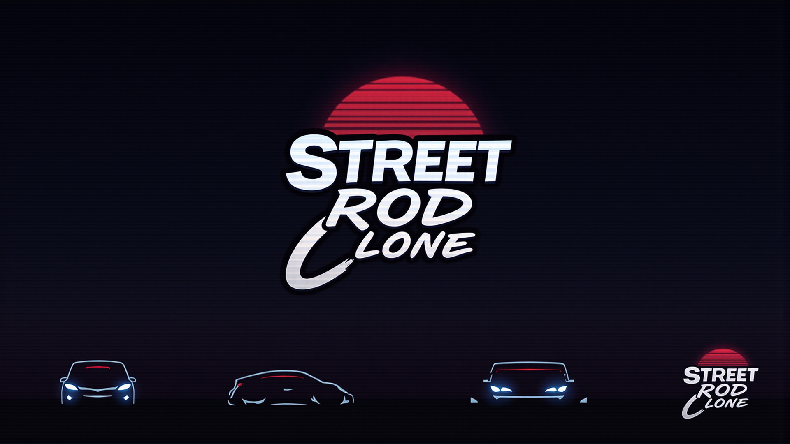

# 🏎️ Street Rod Clone

A modern remake of the classic **Street Rod (1989)**, built using **Vite, React, TypeScript, and SWC**.  
Modify cars, race for pink slips, and challenge **The King**!  

 <!-- Adicione um banner do jogo aqui -->

## 🚀 Features

✅ **Buy and Sell Cars** – Get classic muscle cars and upgrade them  
✅ **Car Customization** – Change engines, transmissions, and more  
✅ **Street Racing** – Drag and circuit races with AI opponents  
✅ **Police Chases** – Avoid getting caught and losing your ride  
✅ **Economy System** – Earn money, place bets, and manage your resources  
✅ **Leaderboard** – Climb the ranks and become the ultimate street racer  

---

## ⚙️ Tech Stack

- ⚡ **[Vite](https://vitejs.dev/)** – Superfast frontend tooling  
- ⚛️ **[React](https://react.dev/)** – Component-based UI  
- 🛠 **[TypeScript](https://www.typescriptlang.org/)** – Strongly typed JavaScript  
- 🚀 **[SWC](https://swc.rs/)** – High-performance TypeScript/JS compiler  
- 🏎 **[React Router](https://reactrouter.com/)** – Navigation and routing  
- 🎨 **CSS Modules** – Scoped styles for UI components  
- 🎶 **Howler.js (optional)** – Manage game audio  

---

## 📂 Project Structure

```
📂 street-rod-clone/  
├── 📄 package.json           # Project dependencies  
├── 📄 tsconfig.json          # TypeScript configuration  
├── 📄 vite.config.ts         # Vite configuration  
├── 📄 .eslintrc.js           # ESLint settings  
├── 📄 .prettierrc            # Prettier settings  
├── 📄 README.md              # Project documentation  
├── 📂 public/                # Static assets (images, sounds)  
│   ├── 📄 favicon.ico  
│   ├── 📄 manifest.json  
│   ├── 📂 images/  
│   └── 📂 sounds/  
├── 📂 src/                   # Source code  
│   ├── 📄 main.tsx           # React entry point  
│   ├── 📄 App.tsx            # Root component  
│   ├── 📂 components/        # Reusable UI components  
│   ├── 📂 pages/             # Game screens  
│   ├── 📂 context/           # Global state management  
│   ├── 📂 hooks/             # Custom React hooks  
│   ├── 📂 services/          # Game logic & APIs  
│   ├── 📂 types/             # TypeScript type definitions  
│   ├── 📂 utils/             # Helper functions  
│   ├── 📂 styles/            # CSS Modules  
│   └── 📂 tests/             # Unit and integration tests  
```

---

## 🚀 Getting Started

### 1️⃣ **Clone the repository**
```bash
git clone https://github.com/your-username/street-rod-clone.git
cd street-rod-clone
```

### 2️⃣ **Install dependencies**
```bash
npm install
```

### 3️⃣ **Start the development server**
```bash
npm run dev
```
The game will be available at **`http://localhost:5173/`** 🚗

### 4️⃣ **Build for production**
```bash
npm run build
```

---

## 🔧 Development Workflow

- **Lint code:** `npm run lint`
- **Format code:** `npm run format`
- **Run unit tests:** `npm run test`
- **Pre-commit checks:** `Husky + lint-staged`

---

## 📜 License

This project is licensed under the **MIT License**.  
See the [LICENSE](LICENSE) file for more details.  

---

## 🤝 Contributing

Contributions are welcome! 🎉  
To contribute:  
1. Fork the repository  
2. Create a new branch (`git checkout -b feature-branch`)  
3. Commit your changes (`git commit -m "Add feature X"`)  
4. Push to your branch (`git push origin feature-branch`)  
5. Open a Pull Request